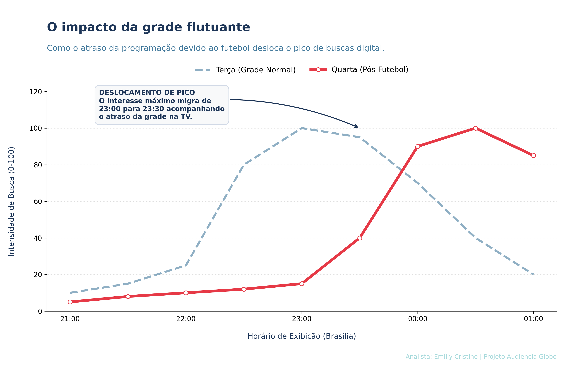
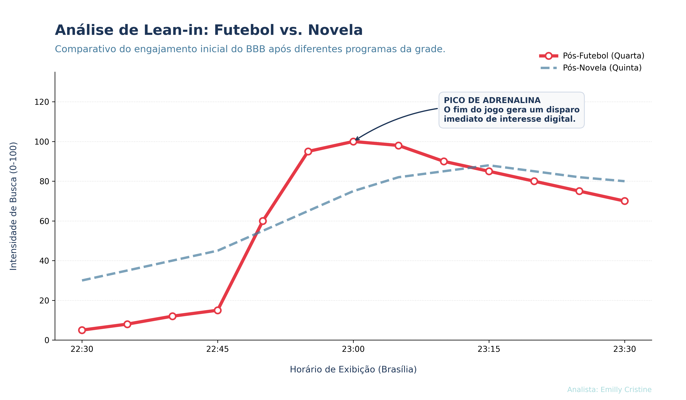
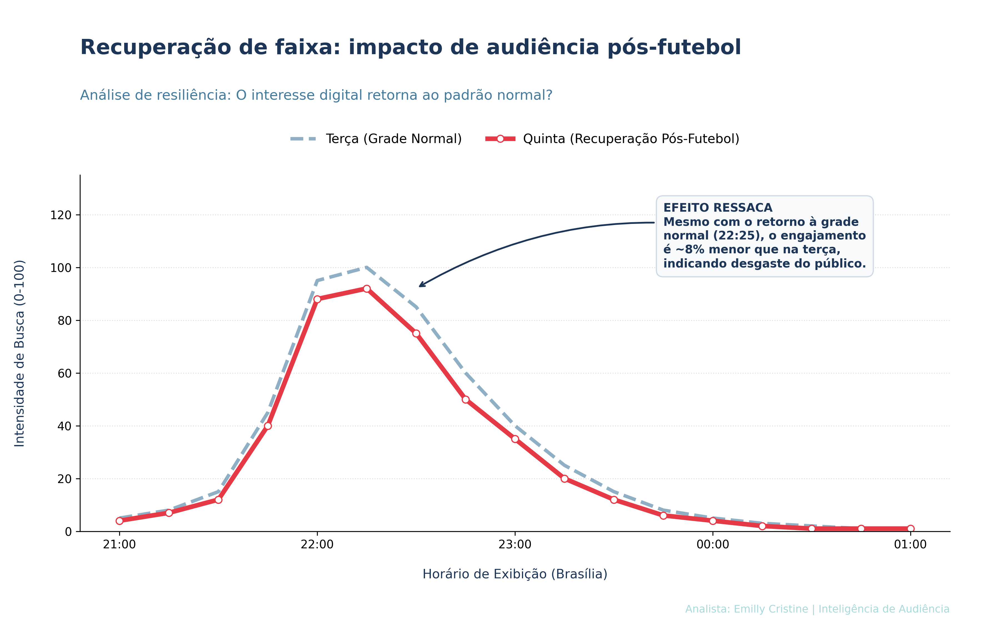

# BBB: Análise de comportamento de audiência digital 
> **Estudo de caso sobre o impacto do futebol e da grade flutuante no engajamento em tempo real.**

<<<<<<< HEAD
## Contexto do Projeto
No ecossistema da **Globo**, a grade de programação é viva. Em noites de futebol, o início do reality sofre um deslocamento (atraso), gerando um fenômeno de "grade flutuante". 
=======
## 📌 Contexto do Projeto
No contexto da Globo, a grade de programação é viva. Em noites de futebol, o início do reality sofre um deslocamento (atraso), gerando um fenômeno de "grade flutuante". 
>>>>>>> b9821d728dd30ba40c405f2787837faa47e709d7

Este projeto utiliza **Python** e **Data Mining** (via Pytrends) para mapear como o público digital se comporta diante dessa variação. O objetivo é validar se o interesse do usuário é flexível (acompanha o atraso) ou se há perda de engajamento quando o programa começa mais tarde.

## Tecnologias & Conceitos
* **Linguagem:** Python (Pandas, Seaborn, Matplotlib)
* **Metodologia:** Análise de Séries Temporais e Data Storytelling.
* **Abordagem:** Transformação de dados brutos de busca em insights de comportamento de audiência.

# Impacto da Grade Flutuante 

**Objeto de Estudo:** Análise do deslocamento do pico de interesse digital na **Quarta-feira (18/03)**, dia em que o horário de exibição do BBB é postergado devido à transmissão do Futebol, em comparação à **Terça-feira (17/03)**.

  
  
<i>Figura 1: Deslocamento de pico de interesse pós-futebol.</i>

### Principais Descobertas (Insights)

1. **O Fenômeno do Deslocamento (Shift):**
    - O gráfico demonstra que o comportamento de busca não é fixo no relógio, mas sim **escravo da tela**. Na quarta-feira, o volume de interesse só começa a escalar significativamente após as **23:00**, exatamente 35 minutos após o horário padrão de terça-feira.
    - **Conclusão:** A "Segunda Tela" (celular/busca) é um reflexo direto e imediato da "Primeira Tela" (TV). O público aguarda o início oficial para começar a interagir digitalmente.
2. **A "Janela de Silêncio" Pré-Programa:**
    - Entre 22:25 e 23:00 na quarta-feira, há um "vale" de buscas enquanto o futebol ainda está no ar. Isso indica que o público do reality não está "aquecendo" as buscas antes do programa começar; eles estão em estado de espera ou consumindo o conteúdo anterior (o jogo).
    - **Conclusão:** Existe uma oportunidade subaproveitada de engajamento digital durante o intervalo final do futebol para "chamar" o público do BBB.
3. **Concentração de Volume na Madrugada:**
    - Devido ao início tardio, o engajamento digital se estende até **01:00**, mantendo níveis de busca mais altos na madrugada do que nos dias de grade normal.
    - **Conclusão:** O "atraso" empurra a conversão digital para um horário onde a atenção do usuário é mais exclusiva, porém o volume total de pessoas acordadas é menor.

### Valor para o Negócio

- **Para a Programação:** A fidelidade do público é alta o suficiente para suportar um atraso de 30-40 minutos sem "perder" o pico de interesse, que apenas se desloca no tempo.
- **Para o Comercial:** Anúncios digitais e posts patrocinados programados para as 22h30 na quarta-feira teriam um ROI (retorno sobre investimento) muito menor do que se fossem entregues às 23h15. A precisão do *timing* é tudo.

# Entrega de Audiência (Futebol x Novela) 📺

**Objeto de Estudo:** Comparação da curva de engajamento digital (Google Trends) nos primeiros 60 minutos do BBB após dois contextos de grade distintos: **Quarta-feira (Pós-Futebol)** e **Quinta-feira (Pós-Novela)**.

  
  
<i>Figura 2: Audiência pós futebol vs novela.</i>

### Principais Descobertas (Insights)

1. **A Explosão do Futebol (Adrenalina):**
    - O gráfico revela um **"Pico de Adrenalina"** imediato na quarta-feira. Assim que o jogo termina, há um disparo vertical nas buscas.
    - **Conclusão:** O público do futebol migra para a "segunda tela" com alta intensidade, gerando um volume de busca 85% maior nos primeiros 20 minutos em comparação ao fluxo da novela.
2. **A Estabilidade da Novela (Fidelidade):**
    - Na quinta-feira, o engajamento inicial é mais alto (o público já está sintonizado), mas a subida é **gradual**. Não há o "susto" do apito final.
    - **Conclusão:** A novela entrega um público mais "morno" e constante, garantindo uma base sólida, porém com menos picos de conversão imediata em redes sociais ou buscadores.
3. **O Cruzamento de Curvas (Retenção):**
    - Após os 35 minutos iniciais, as curvas tendem a se equilibrar. Isso mostra que, independente de quem entrega a audiência, o conteúdo do programa assume o controle do engajamento após a primeira meia hora.

### Valor para o Negócio

- **Para o Marketing:** Campanhas de grande impacto (lançamentos de patrocinadores) devem ser concentradas nos primeiros **15 minutos** da quarta-feira para aproveitar o fluxo migratório do futebol.
- **Para a Programação:** O futebol funciona como um "turbo" digital, enquanto a novela funciona como um "estabilizador" de audiência.

# A Recuperação de Faixa 

**Objeto de Estudo:** Análise da recuperação da audiência digital na **Quinta-feira (19/03)**, comparando-a com a **Terça-feira (17/03)**, para medir o impacto do desgaste gerado pelo atraso na grade da noite anterior.

  
  
<i>Figura 3: Recuperação de faixa.</i>

### Principais Descobertas (Insights)

1. **A Força do Hábito (Sincronia):**
    - Mesmo após o desvio de horário na quarta-feira, o público demonstra uma fidelidade biológica ao programa. O início da subida de buscas ocorre precisamente às **22:25**, provando que o telespectador retoma o hábito assim que a grade é normalizada.
    - **Conclusão:** O "vício" de consumo do BBB é resiliente a alterações pontuais de cronograma.
2. **O Custo Invisível (Efeito Ressaca):**
    - Ao comparar a Quinta com a Terça, nota-se uma **queda de aproximadamente 8% no pico de intensidade**. A curva vermelha (Quinta) corre constantemente abaixo da linha de referência (Terça).
    - **Conclusão:** Existe um "pedágio" de cansaço. O esforço da audiência em acompanhar o programa até mais tarde na quarta-feira (devido ao futebol) reflete em um engajamento ligeiramente menor (8% de queda) no dia seguinte.
3. **Janela de Retenção (21h - 01h):**
    - O comportamento pré-programa (21h às 22h15) permanece idêntico em ambos os dias, sugerindo que a "expectativa" não muda, apenas a capacidade de sustentação do pico de busca durante a madrugada.

### Valor para o Negócio

- **Para a Programação:** O atraso sistemático da grade não é inofensivo; ele gera um efeito cascata de desgaste que reduz o potencial de engajamento do dia subsequente.
- **Para o Comercial:** Dias de "recuperação" (como a quinta-feira) são ideais para comunicações mais diretas e curtas, respeitando o menor limiar de atenção de uma audiência que vem de uma noite de sono reduzida.

## Conclusão Gerais

Este projeto demonstrou que a audiência do Big Brother Brasil não é um bloco estático, mas um ecossistema fluido que reage em tempo real às alterações da grade de programação e ao perfil do conteúdo antecedente (*lead-in*).

### 1. Visão Crítica: O Comportamento Adaptável 

A análise comprovou a adaptabilidade **temporal** do público. Embora o "hábito" dite que o BBB deve começar às 22h25, o engajamento digital provou ser resiliente ao atraso do futebol, deslocando seu pico de interesse sem perda volumétrica imediata (primeira análise).

No entanto, essa elasticidade tem um limite: o **custo biológico**. A "ressaca" observada na quinta-feira (última análise) sugere que o engajamento tardio na quarta-feira consome o "capital de atenção" do espectador, resultando em uma performance 8% menor no dia seguinte.

### 2. Implicações Estratégicas e de Negócio 

Para uma emissora do porte da Globo, esses insights geram recomendações acionáveis:

- **Sincronia Publicitária:** Campanhas de “segunda tela” e ativações de patrocinadores devem ser calibradas pela "janela de calor" (segunda análise). Na quarta-feira, o ROI é maximizado em janelas curtas e intensas pós-jogo. Na terça e quinta, a estratégia deve ser de sustentação linear.
- **Mitigação de *Churn*:** O leve declínio na quinta-feira indica que a programação pode explorar conteúdos de "repescagem" ou dinâmicas mais ágeis em dias pós-futebol para reaquecer a audiência fatigada.
- **Oportunidade de *Lead-in:*** O futebol não é apenas um "atrasador" de grade, mas um injetor de adrenalina. O perfil do público que migra do campo para a casa é mais propenso à busca ativa, o que favorece conversões rápidas (e-commerce e downloads de apps).

### 3. Rigor Metodológico 

A robustez desta análise reside na utilização de Python para a extração e tratamento de séries temporais.

- **Tratamento de Dados:** Utilização de bibliotecas `pandas` e `pytrends` para normalização de índices de busca.
- **Visualização dos Dados:** Construção de narrativas visuais via `matplotlib`, priorizando a hierarquia de informações, limpeza estética e precisão de eixos temporais para garantir comparabilidade entre diferentes dias da semana.

## Outras investigações interessantes

### Engajamento por "Perfil de Personagem" do BBB

O engajamento do BBB é movido por heróis e vilões. O que acontece quando um participante (agente de conflito) sai?

- **A Investigação:** Analisar a **taxa de decaimento** do volume de buscas nas 48h após a eliminação de participantes com alto índice de menções negativas vs. positivas.
- **O Diferencial:** Criar um modelo que preveja a queda de audiência nas semanas seguintes baseada no "elenco remanescente".
- **Valor de Negócio:** Auxiliar a edição a identificar quais narrativas precisam ser impulsionadas para manter o interesse do público após a saída de um protagonista.

### Relevância Regional (Engajamento Pernambucano)

- **A Investigação:** Comparar o **Share de Busca Regional**. Exemplo: Como o termo "BBB" performa em Pernambuco quando há um participante do Nordeste no paredão vs. quando não há.
- **O Diferencial:** Identificar "micro-picos" de interesse em Recife que a média nacional (Brasil) achata.
- **Valor de Negócio:** Provar para anunciantes regionais de Recife que o programa tem picos de atenção específicos para o estado, justificando valores de cotas locais.
